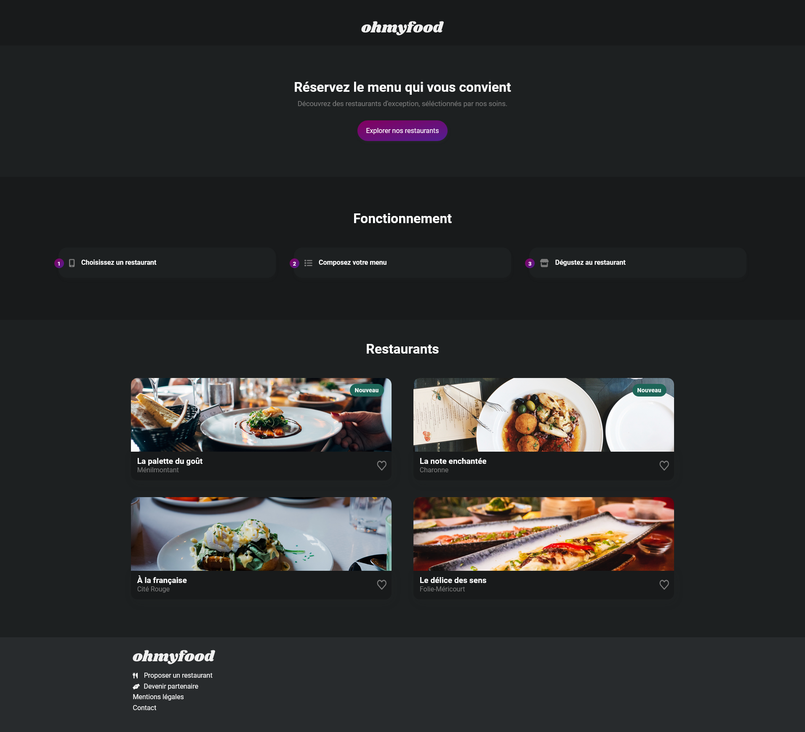

This is a remake of a previous project (https://github.com/AChanty/OCR---P3-Ohmyfood), now using React. 
Project live at : https://achanty.github.io/ohmyfood-react/#/

## Table of contents

-  [Overview](#overview)
   -  [Screenshot](#screenshot)
   -  [Links](#links)
-  [My process](#my-process)
   -  [Built with](#built-with)
   -  [Useful resources](#useful-resources)
-  [Author](#author)

## Overview

### Screenshot

### Links

-  Live Site URL: [https://achanty.github.io/ohmyfood-react/#/](https://achanty.github.io/ohmyfood-react/#/)

## My process

### Built with

-  [React](https://reactjs.org/) - JS library
-  Semantic HTML5 markup
-  CSS custom properties
-  Sass preprocessor
-  Mobile-first workflow

### Useful resources

-  [Original project](https://achanty.github.io/OCR---P3-Ohmyfood/) - Original project, using html/css/sass only

## Author

-  Linkedin - [Anthony Chanty](https://www.linkedin.com/in/anthony-c-a925a6172/)
-  Frontend Mentor - [@achanty](https://www.frontendmentor.io/profile/AChanty)
